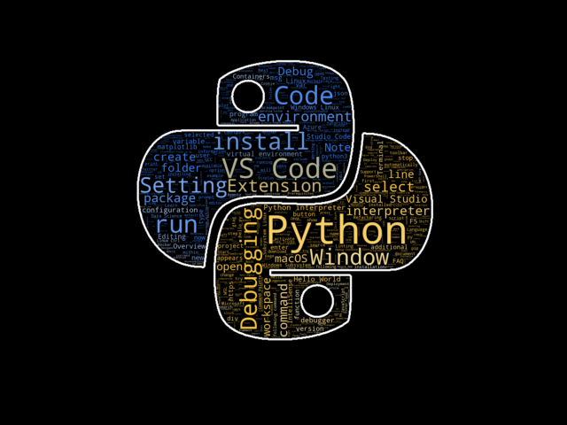

# pvscc-logo
Demo for creating a word cloud based on the [Python for VS Code](https://code.visualstudio.com/docs/python/python-tutorial) Getting Started Tutorial.




## Prerequisites
- [Python 3](https://www.python.org/downloads/)
- [VS Code](https://code.visualstudio.com/)
- [Python extension for VS Code](https://marketplace.visualstudio.com/items?itemName=ms-python.python)

## Create a virtual environment 
- In this project's directory, create a new virtual environment using Python 3 and activate it.

    On Windows:
     ```shell
    $ py -m venv env
    $ env\Scripts\activate
    ```
    On MacOs/Linux:
    ```shell
    $ python3 -m venv env
    $ source env/bin/activate
    ```
## Install the dependencies
- Install dependencies from requirements.txt:

    ```shell
    (env)$ pip install -r requirements.txt
    ```
## Run the Flask app

- Open the project folder in VS Code:
    ```shell
    $ code .
    ```

- Make sure the Python interpreter selected on the status bar (on the bottom left) matches the one from the environment you created. If not, select it opening the command palette (`View` > `Command Palette...`) and running the `Python: Select Interpreter` command)

- Press <kbd>F5</kbd> to start debugging, or <kbd>Ctrl</kbd> + <kbd>F5</kbd> to run without debugging

- Press <kbd>Ctrl</kbd> and click on the link that will be displayed on the terminal:
    ```
    * Serving Flask app "logo_app.webapp" (lazy loading)
    * Environment: development
    * Debug mode: on
    * Restarting with stat
    * Debugger is active!
    * Debugger PIN: 171-261-395
    * Running on http://127.0.0.1:5000/
    ```
## Configure the application tests
- Open the command palette (<kbd>Ctrl</kbd> + <kbd>Shift</kbd> + <kbd>P</kbd> or <kbd>Command</kbd> + <kbd>Shift</kbd> + <kbd>P</kbd> if you're on MacOS) and run `Python: Configure Tests`
- From the configuration menu, select `pytest` and then `.` (for current folder, where the test file is)
- Run the application test:
    - Click on the test explorer icon on the actiity bar, located on the left and click on the `Run All Tests` icon, or
    - Open the command palette and run `Python: Run All Tests`
- Fix the application test:
    -  On line 14, replace `io.BytesIO` with `str` 